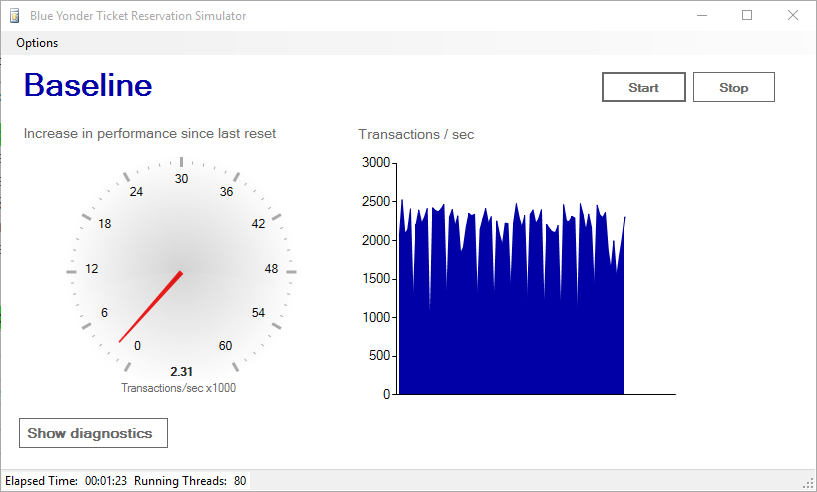

# Ticket Reservations Sample

Ticket Reservations is a Windows Forms sample application built on .NET Framework 4.6 that demonstrates the performance benefits of using SQL Server memory optimized tables and native compiled stored procedures. You can compare the performance before and after enabling In-Memory OLTP by observing the transactions/sec as well as the current CPU Usage and latches/sec.

## About this sample

**Platforms:**
- SQL Server (starting with 2016)
- Azure SQL Database

**Features:**
- In-memory OLTP

**Languages:**

- TSQL
- C#

## Running this sample
1. Before you can run this sample, you must have the following perquisites:
	- SQL Server 2016 CTP3 (or higher)
	- Visual Studio 2015 (or higher) with the latest SSDT installed.

2. Clone this repository using Git for Windows (http://www.git-scm.com/), or download the zip file.

3. From Visual Studio, open the **InMemoryOLTPDemo.sln** file from the root directory.

4. In Visual Studio Build menu, select **Build Solution** (or Press F6).

5. In the **App.config** file, located in the project root, find the **TicketReservations** app setting and edit the connectionString if needed. Currently it is configured to connect to the local default SQL Server Instance using Integrated Security.

6. Publish the TicketReservations Database
  - Right click on the TicketReservations SQL Server Database Project and Select **Publish**
  - Click Edit... to choose your connection string
  - Click Publish
  - Note: For publishing to Azure SQL you need to change the DB project target platform to **Microsoft Azure SQL Database V12**

7. You can now run and debug the application locally by pressing **F5** in Visual Studio.

8. Start the workload with the **Start** button, and run for a while to show perf profile. Then press stop to stop the workload.

9. In the database project,
	- Change TicketReservations.sql to a memory-optimized table (instructions commented in the file itself)
	- Change InsertTicketReservations.sql to natively compiled (instructions in the same file)

10. Publish the database project to the same database – the tool will take care of making the necessary changes.
		Note that, as part of publication, the data is copied from the old disk-based table to the new memory-optimized table, so the longer you run the initial workload, the longer this publication takes.

11. Go back to the app and run the workload again. No need to recompile or restart the application.

The perf gains from In-Memory OLTP as shown by the load generation app depend on two factors:
-	Hardware
  -	more cores => higher perf gain
  -	slower log IO => lower perf gain
-	Configuration settings in the load generator
  -	more rows per transaction => higher perf gain
  -	more reads per write => lower perf gain
  -	default setting is 10 rows per transaction and 1 read per write

With default settings on one machine with 24 logical cores and relatively slow SSD for the log the app shows around performance 40X gain, and in this case the bottleneck was log IO.

## About the code
The code included in this sample is not intended to be a set of best practices on how to build scalable enterprise grade web applications. This is beyond the scope of this quick start sample.

## More information
- [In-Memory OLTP (In-Memory Optimization)] (https://msdn.microsoft.com/en-us/library/dn133186.aspx)
- [OLTP and database management] (https://www.microsoft.com/en-us/server-cloud/solutions/oltp-database-management.aspx)
